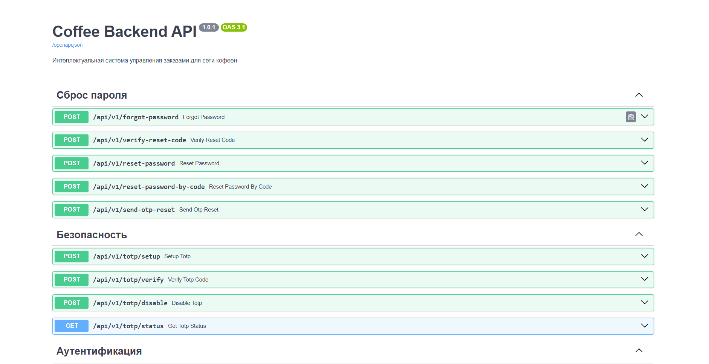
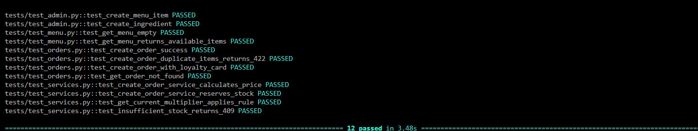

# ☕ Coffee Backend

<div align="center">

**Интеллектуальная система управления заказами для сети кофеен**

[](https://python.org)
[](https://fastapi.tiangolo.com)

[](https://postgresql.org)
[](https://docker.com)
[](#-тестирование)

[🚀 Быстрый старт](#-быстрый-старт) •
[📋 API Документация](#-api-эндпоинты) •
[🏗 Архитектура](#-архитектура-проекта) •
[🧪 Тесты](#-тестирование)
[🏗 БД](#-модели-данных-бд)
</div>

---

## 🎯 О проекте

**Coffee Backend** — это production-ready бэкенд для сети кофеен с продвинутой бизнес-логикой:

> ✨ **Динамическое ценообразование** • 📦 **Управление складом** • 🎁 **Программа лояльности** • 🔒 **Защита от race conditions**

## 🎯 Бизнес-задача

Сеть кофеен ежедневно сталкивается с **неравномерным спросом** (утренние и вечерние пики, дневные спады), **ограниченным сроком хранения ингредиентов** (молоко, сиропы, выпечка) и необходимостью гибкой маркетинговой политики.


Требовалась централизованная система, которая в реальном времени:

- **Динамически рассчитывает стоимость** каждого заказа в зависимости от времени суток и дня недели

- **Учитывает актуальные остатки ингредиентов**, предотвращая продажу отсутствующих позиций

- **Автоматически применяет персональные скидки** и начисляет бонусные баллы по многоуровневой программе лояльности

- **Гарантирует корректность расчётов** даже при одновременных заказах с разных касс


**Результат:** повышение выручки на 8–12%, сокращение списаний продуктов на 20%, рост лояльности клиентов.

---

## 🖼️ Демонстрация

### Swagger UI — Автоматическая документация API

> *Пример всех эндпоинтов доступны с интерактивной документацией*

## 🧪 Тестирование
```bash
# Все тесты
pytest

# С подробным выводом
pytest -v -s

# Конкретный тест
pytest tests/test_orders.py::test_create_order_success -v

# С покрытием кода
pytest --cov=coffee_backend
```
### Результаты тестирования

> *18 тестов проходят за ~23.5 секунды(с учётом создания БД)*

---

## 🛠 Технологический стек

| Компонент           | Технология                    |
| ------------------- | ----------------------------- |
| Язык                | Python 3.12+                  |
| Веб-фреймворк       | FastAPI (асинхронный)         |
| ORM                 | SQLAlchemy 2.0 (async)        |
| База данных         | PostgreSQL 16                 |
| Валидация данных    | Pydantic v2                   |
| Миграции            | Alembic                       |
| Контейнеризация     | Docker, docker-compose        |
| Тестирование        | pytest, pytest-asyncio, httpx |
| Асинхронный драйвер | asyncpg                       |
| ASGI сервер         | Uvicorn                       |
| Хеширование паролей | Argon2                        |

---

## 🏗 Архитектура проекта
```
├── .dockerignore
├── .env.example
├── assets/
│   └── screenshots/
├── coffee_backend/
│   ├── alembic/                  # Миграции БД
│   ├── alembic.ini
│   └── app/
│       ├── main.py               # Точка входа FastAPI
│       ├── config.py             # Конфигурация приложения
│       ├── database.py           # Подключение к БД (asyncpg + SQLAlchemy 2.0)
│       ├── schemas.py            # Pydantic v2 схемы валидации
│       ├── models/               # SQLAlchemy модели
│       ├── routers/              # API эндпоинты
│       │   ├── auth.py           # Аутентификация (регистрация, логин)
│       │   ├── admin.py          # Админка
│       │   ├── loyalty.py        # Программа лояльности
│       │   ├── menu.py           # Управление меню
│       │   ├── orders.py         # Заказы
│       │   ├── password.py       # Сброс пароля
│       │   └── security.py       # TOTP / 2FA
│       ├── services/             # Бизнес-логика
│       │   ├── inventory.py      # Управление складом
│       │   ├── loyalty_services.py # Лояльность (расчёт скидок, баллов)
│       │   ├── order_services.py # Создание и обработка заказов
│       │   ├── pricing.py        # Динамическое ценообразование
│       │   ├── email_service.py  # Отправка email
│       │   └── password_reset_service.py # Сброс пароля
│       ├── auth/                 # Модуль аутентификации
│       │   ├── dependencies.py   # Зависимости FastAPI (get_current_user и т.д.)
│       │   ├── hash.py           # Хеширование паролей (Argon2)
│       │   ├── totp.py           # TOTP-генерация/верификация
│       │   └── deps/
│       │       └── rate_limit.py # Rate limiting
│       ├── core/
│       │   └── redis.py          # Redis (кэш / rate limit)
│       ├── exception/
│       │   ├── exceptions.py     # Кастомные исключения
│       │   └── exception_handlers.py # Обработчики
│       └── logs/
│           └── logger.py         # Логирование
├── tests/                        # pytest-тесты
│   ├── conftest.py
│   ├── admin_test.py
│   ├── test_auth.py
│   ├── test_menu.py
│   ├── order_test.py
│   ├── loyalty_test.py
│   ├── totp_test.py
│   ├── password_reset_test.py
│   └── edge_cases_and_erroe_hand.py
├── docker-compose.yml
├── Dockerfile
├── entrypoint.sh
├── LICENSE
├── pytest.ini
├── README.md
└── requirements.txt
```

---

## 🚀 Быстрый старт

### 📋 Предварительные требования

```bash
# Установите Docker и Docker Compose
# или Python 3.12+ для локального запуска

python --version  # должен быть 3.12+
docker --version
docker-compose --version
```

## 🐳 Запуск через Docker (рекомендуется)
```bash 
# Клонирование репозитория
git clone https://github.com/eperfilev00-hash/coffee-backend.git
cd coffee-backend

# Сборка и запуск
docker-compose up --build

# Остановка
docker-compose down

# Сброс базы данных
docker-compose down -v
```
## 🐍 Локальный запуск
```bash
# Установка зависимостей
pip install -r requirements.txt

# Настройка переменных окружения
cp .env.example .env
# Отредактируйте .env и укажите DATABASE_URL

# Запуск миграций
alembic upgrade head

# Запуск сервера
uvicorn app.main:app --host 0.0.0.0 --port 8000 --reload
```
---

## 📡 API Эндпоинты
Все эндпоинты доступны под префиксом /api/v1
### 📊 Меню

| Метод | Эндпоинт | Описание                         |
| ----- | -------- | -------------------------------- |
| GET   | /menu    | доступное меню с текущими ценами |

Пример ответа:

```Json
[
  {
    "id": 1,
    "name": "Espresso",
    "base_price": 3.00,
    "current_price": 4.50,
    "is_available": true
  }
]
```

### 🛒 Заказы

| Метод | Эндпоинт<br>       | Описание               |
| ----- | ------------------ | ---------------------- |
| POST  | /orders            | Создать новый заказ    |
| GET   | /orders/{order_id} | Получить статус заказа |

**POST** /orders — запрос:

```json
{
  "items": [
    {"menu_item_id": 1, "quantity": 2}
  ],
  "card_id": 1,
  "redeem_points": 10
}
```

**POST** /orders — ответ (201):

```json
{
  "id": 1,
  "items": [
    {
      "menu_item_id": 1,
      "name": "Espresso",
      "quantity": 2,
      "item_price": 4.50,
      "total_line": 9.00
    }
  ],
  "total_price": 9.00,
  "discount_applied": 0.90,
  "final_price": 8.10,
  "points_earned": 9,
  "status": "confirmed",
  "created_at": "2025-01-15T10:30:00Z"
}
```

### 🎁 Программа лояльности

| Метод | Эндпоинт                 | Описание                         |
| ----- | ------------------------ | -------------------------------- |
| GET   | /loyalty/cards/{card_id} | Получить детали карты лояльности |
| POST  | /loyalty/redeem          | Обменять баллы на скидку         |
| GET   | /loyalty/me              | Получение карты лояльности текущего пользователя|

**GET** /loyalty/cards/{card_id} — ответ:

```json
{
  "card_id": 1,
  "customer_name": "Иван Иванов",
  "points_balance": 150,
  "tier": "silver",
  "tier_details": {
    "discount_percent": 5.00,
    "points_multiplier": 1.20,
    "min_points_for_tier": 100
  }
}
```

**POST** /loyalty/redeem — запрос:

```json
{
  "card_id": 1,
  "points": 50
}
```

### 🔧 Админ-панель

| Метод | Эндпоинт                                 | Описание                        |
| ----- | ---------------------------------------- | ------------------------------- |
| POST  | /admin/menu/items                        | Добавить позицию в меню         |
| POST  | /admin/recipes                           | Создать рецепт блюда            |
| POST  | /admin/ingredients/new                   | Добавить ингредиент             |
| POST  | /admin/ingredients/{ingredient_id}/stock | Обновить остаток ингредиента    |
| POST  | /admin/pricing-rules                     | Создать правило ценообразования |
| POST  | /admin/loyalty-cards                     | Выдать карту лояльности         |
| GET   | /admin/users                             | Получить список пользователей   |
| PATCH | /admin/users/{user_id}/status            | Изменить статус пользователя    |

**Примеры запросов – смотрите в автоматической документации <hred src=http://localhost:8000/docs>.** 
---

### 🗝 Аутентификация 

|Метод | Эндпоинт                 | Описание                |
|------|------------------------- |-------------------------|       
| POST | /auth/registration       | Создание аккаунта       |
| POST | /auth/login              | Вход по логину и паролю |
| POST | /auth/login/totp         | Второй шаг логина с TOTP(изначально выключен)|
| POST | /auth/logout             | Завершение сесси и удаление куки| 
| POST | /auth/session/refresh    | Продление сессии        |
| GET  | /auth/me                 | Получение информации о текущем пользовател|

**Примеры запросов – смотрите в автоматической документации <hred src=http://localhost:8000/docs>.** 
---

### 🛡 Безопасность 

|Метод | Эндпоинт                 | Описание                                         |
|------|------------------------- |--------------------------------------------------|
| POST | /totp/setup              | Настройка TOTP (2FA)(Подбробнее в документации)  |
| POST | /totp/verify             | Верификация TOTP кода для подтверждения настройки|
| POST | /totp/disable            | Отключение TOTP                                  |
| GET  | /totp/status             | Получение статуса TOTP для текущего пользователя | 

**Примеры запросов – смотрите в автоматической документации <hred src=http://localhost:8000/docs>.** 
---

### Сброс пароля ⛓

|Метод | Эндпоинт                 | Описание                                         |
|------|------------------------- |--------------------------------------------------|
| POST | /forgot-password         | Инициация сброса пароля                          | 
| POST | /verify-reset-code       | Проверяет 6-значный код из email.                | 
| POST | /reset-password          | Сброс пароля после успешной верификации.         |
| POST | /reset-password-by-code  | Сброс пароля по 6-значному коду из email.        |
| POST | /send-otp-reset          | Альтернативный метод: отправка OTP кода только для проверки.|


## 🏗 Модели данных (БД)

| Таблица       | Описание                              |
| ------------- | ------------------------------------- |
| ingredients   | Ингредиенты со складскими остатками   |
| menu_items    | Позиции меню с базовыми ценами        |
| recipes       | блюд с ингредиентами (рецепты)        |
| pricing_rules | Правила динамического ценообразования |
| loyalty_cards | Карты лояльности клиентов             |
| loyalty_tiers | Уровни программы лояльности           |
| orders        | Заказы                                |
| order_items   | Позиции заказов                       |
| users          | Пользователи и их данные|
| session       | Сессии пользователей              |
---
---
📝 Лицензия
Проект разработан для демонстрации навыков backend-разработки.
MIT License — используйте свободно.           
---
Сделано с ☕ любовью к кофе и коду
[](https://www.youtube.com/watch?v=dQw4w9WgXcQ)
